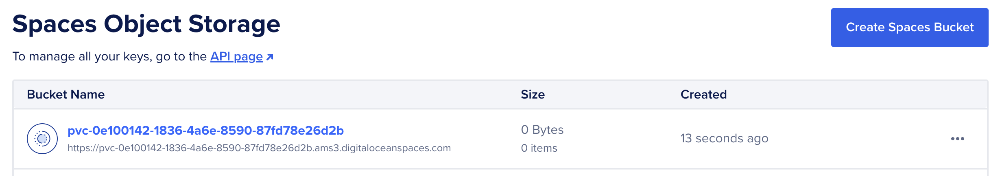
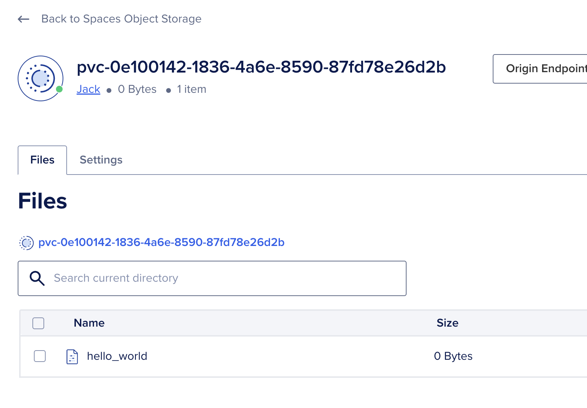

# Description

[k8s-csi-s3](https://github.com/yandex-cloud/k8s-csi-s3) allows you to use a DigitalOcean Spaces Object Storage bucket as ReadWriteMany (RWX) storage for a Kubernetes Pod with DOKS (DigitalOcean Kubernetes).

By default, csi-s3 will create a new bucket per volume. The bucket name will match that of the volume ID. Under the hood it uses [GeeseFS](https://github.com/yandex-cloud/geesefs) which allows you to mount an S3 bucket as a file system.

**Note:**
As S3 is not a real file system there are some [limitations](https://github.com/yandex-cloud/geesefs#posix-compatibility-matrix) to consider.

> *[DigitalOcean Spaces Object Storage](https://www.digitalocean.com/products/spaces) is an S3-compatible object storage service that lets you store and serve large amounts of data. Each Space is a bucket for you to store and serve files. The built-in Spaces CDN minimizes page load times and improves performance.*

## About GeeseFS

> *Finally, an exemplary FUSE FS implementation over S3*

- [GeeseFS](https://github.com/yandex-cloud/geesefs) allows you to mount an S3 bucket as a file system.
- FUSE file systems based on S3 typically have performance problems, especially with small files and metadata operations.
- GeeseFS **attempts to solve these problems** by using aggressive parallelism and asynchrony.
- GeeseFS is stable enough to pass most applicable xfstests, including dirstress/fsstress stress-tests (generic/007, generic/011, generic/013).
- [Benchmarks](https://github.com/yandex-cloud/geesefs/tree/master/bench) compared to rclone+cache, goofys and s3fs.

## k8s-csi-s3 Diagram

The following diagram shows how k8s-csi-s3 works on a DigitalOcean Kubernetes cluster (DOKS) (based on the example used in the getting started section):


## Software included


| Package    | License                                                                      |
| ------------ | ------------------------------------------------------------------------------ |
| k8s-csi-s3 | [Apache 2.0](https://github.com/yandex-cloud/k8s-csi-s3/blob/master/LICENSE) |

## Connecting to Your Cluster

You can connect to your DigitalOcean Kubernetes cluster by following our [how-to guide](https://www.digitalocean.com/docs/kubernetes/how-to/connect-to-cluster).

### Using k8s-csi-s3 for the first time

**Prerequisites**

1. A DigitalOcean[Spaces Object Storage subscription](https://docs.digitalocean.com/products/spaces/how-to/create/)
2. A Spaces [API Access Key](https://docs.digitalocean.com/products/spaces/how-to/manage-access/#access-keys)

1. First, let's check that the 1-Click deployed succesfully with: `kubectl get storageclasses.storage.k8s.io`, we should see a new StorageClass called `csi-s3`

```text
NAME                          PROVISIONER                 RECLAIMPOLICY   VOLUMEBINDINGMODE   ALLOWVOLUMEEXPANSION   AGE csi-s3                        ru.yandex.s3.csi            Delete          Immediate           false                  24m
```

2. We must create a secret in our cluster so that k8s-csi-s3 can authenticate against your DigitalOcean Spaces account

Replace the `endpoint` URL with the same region as your DOKS cluster.
`<br>`Spaces availability per region is detailed [here.](https://docs.digitalocean.com/products/platform/availability-matrix/#other-product-availability)

```yaml
apiVersion: v1
kind: Secret
metadata:
  name: csi-s3-secret
  namespace: kube-system
stringData:
  accessKeyID: <YOUR_ACCESS_KEY_ID>
  secretAccessKey: <YOUR_SECRET_ACCESS_KEY>
  endpoint: https://ams3.digitaloceanspaces.com
```

### Using k8s-csi-s3 with your workloads

#### Deploy an example PVC

Create a Dynamically provisioned PVC using the new storage class. A bucket or path inside bucket will be created automatically for the PV and removed when the PV will be removed

```yaml
apiVersion: v1
kind: PersistentVolumeClaim
metadata:
  name: csi-s3-pvc
  namespace: default
spec:
  accessModes:
  - ReadWriteMany
  resources:
    requests:
      storage: 5Gi
  storageClassName: csi-s3
```

`kubectl create -f https://raw.githubusercontent.com/digitalocean/marketplace-kubernetes/master/stacks/csi-s3/assets/examples/pvc.yaml`

Check if the PVC has been bound with `kubectl get pvc csi-s3-pvc`

```text
NAME         STATUS   VOLUME                                     CAPACITY   ACCESS MODES   STORAGECLASS   VOLUMEATTRIBUTESCLASS   AGE
csi-s3-pvc   Bound    pvc-0e100142-1836-4a6e-8590-87fd78e26d2b   5Gi        RWX            csi-s3         <unset>                 31m
```

At this stage you'll see a new bucket created in your DigitalOcean account:



And you'll see the S3 bucket created in the provisioner logs `kubectl logs -l app=csi-s3-provisioner -c csi-s3 -n kube-system`

```text
I0614 11:40:30.145112       1 driver.go:81] Enabling controller service capability: CREATE_DELETE_VOLUME
I0614 11:40:30.145121       1 driver.go:93] Enabling volume access mode: MULTI_NODE_MULTI_WRITER
I0614 11:40:30.145491       1 server.go:108] Listening for connections on address: &net.UnixAddr{Name:"//var/lib/kubelet/plugins/ru.yandex.s3.csi/csi.sock", Net:"unix"}
I0614 11:40:30.798063       1 utils.go:97] GRPC call: /csi.v1.Identity/Probe
I0614 11:40:30.798942       1 utils.go:97] GRPC call: /csi.v1.Identity/GetPluginInfo
I0614 11:40:30.800097       1 utils.go:97] GRPC call: /csi.v1.Identity/GetPluginCapabilities
I0614 11:40:30.800931       1 utils.go:97] GRPC call: /csi.v1.Controller/ControllerGetCapabilities
I0614 11:41:54.254968       1 utils.go:97] GRPC call: /csi.v1.Controller/CreateVolume
I0614 11:41:54.255071       1 controllerserver.go:69] Got a request to create volume pvc-0e100142-1836-4a6e-8590-87fd78e26d2b
I0614 11:42:00.657408       1 controllerserver.go:91] create volume pvc-0e100142-1836-4a6e-8590-87fd78e26d2b
```

#### Deploy an example Pod

1. Create a test pod that mounts your volume:

```yaml
apiVersion: v1
kind: Pod
metadata:
  name: csi-s3-test-nginx
  namespace: default
spec:
  containers:
   - name: csi-s3-test-nginx
     image: nginx
     volumeMounts:
       - mountPath: /usr/share/nginx/html/s3
         name: webroot
  volumes:
   - name: webroot
     persistentVolumeClaim:
       claimName: csi-s3-pvc
       readOnly: false
```

`kubectl create -f https://raw.githubusercontent.com/digitalocean/marketplace-kubernetes/master/stacks/csi-s3/assets/examples/pod.yaml`

If the pod can start, everything should be working.

2. Test the mount

```bash
kubectl exec -it pod/csi-s3-test-nginx -- bash
mount | grep fuse
```

```text
pvc-035763df-0488-4941-9a34-f637292eb95c: on /usr/share/nginx/html/s3 type fuse.geesefs (rw,nosuid,nodev,relatime,user_id=65534,group_id=0,default_permissions,allow_other)
```

`touch /usr/share/nginx/html/s3/hello_world`

You'll see a blank `hello_world` created in your bucket:



**For additional configuration options such as using an existing bucket see: [Additional Configuration](https://github.com/yandex-cloud/k8s-csi-s3/tree/master?tab=readme-ov-file#additional-configuration)**

## Benchmarks

Spaces Object Storage limits are [detailed here](https://docs.digitalocean.com/products/spaces/details/limits/)

### Tests using `dd` and `fio`

- Use[`gen_small.py`](https://github.com/yandex-cloud/geesefs/blob/master/bench/gen_small.py) to create 6400 files, sized 0.5-300KB, 30KB on average, sharded over 1024 dirs with 2 level deep nesting
  - Copy this directory
  - Delete this directory
- Write 1GB and 5GB files to Spaces Object Storage
- Read 1GB and 5GB files from Spaces Object Storage


| Test                 | Command                                                      | Time      | Detail    |
| ---------------------- | -------------------------------------------------------------- | ----------- | ----------- |
| Create 6400 files    | python3 gen_small.py /mnt/s3/test1                           | 11.3 s    |           |
| Copy the directory   | cp -r test1 test2                                            | 7.8 s     |           |
| Delete the directory | rm -r test1                                                  | 1.2 s     |           |
| Write 1GB            | dd if=/dev/zero of=largefile bs=1MB count=1000 oflag=direct  | 6.8215 s  | 147 MB/s  |
| Read 1GB             | dd if=largefile of=/dev/null bs=1MB iflag=direct             | 2.02862 s | 493 MB/s  |
| Write 5GB            | dd if=/dev/zero of=largefile5 bs=1MB count=5000 oflag=direct | 56.2905 s | 88.8 MB/s |
| Read 5GB             | dd if=largefile5 of=/dev/null bs=1MB iflag=direct            | 7.60369 s | 658 MB/s  |

### Dbench

Benchmarks ran using [dbench](https://github.com/jkpedo/dbench/tree/doks)

#### Native volume benchmarks

Below are the results of an `s-2vcpu-4gb-amd` worker node with a 1TB Volume attached using the `do-block-storage` storageClass

```text
==================
= Dbench Summary =
==================
Random Read/Write IOPS: 9986/9987. BW: 384MiB/s / 387MiB/s
Average Latency (usec) Read/Write: 750.36/399.11
Sequential Read/Write: 384MiB/s / 395MiB/s
Mixed Random Read/Write IOPS: 7515/2471
```

#### S3 benchmarks

```text
==================
= Dbench Summary =
==================
Random Read/Write IOPS: 126/1431. BW: 15.4MiB/s / 47.2MiB/s
Average Latency (ms) Read/Write: 36.1/3.1
Sequential Read/Write: 64.9MiB/s / 61.2MiB/s
Mixed Random Read/Write IOPS: 46/14
```

## Upgrade instructions

## Uninstall instructions
